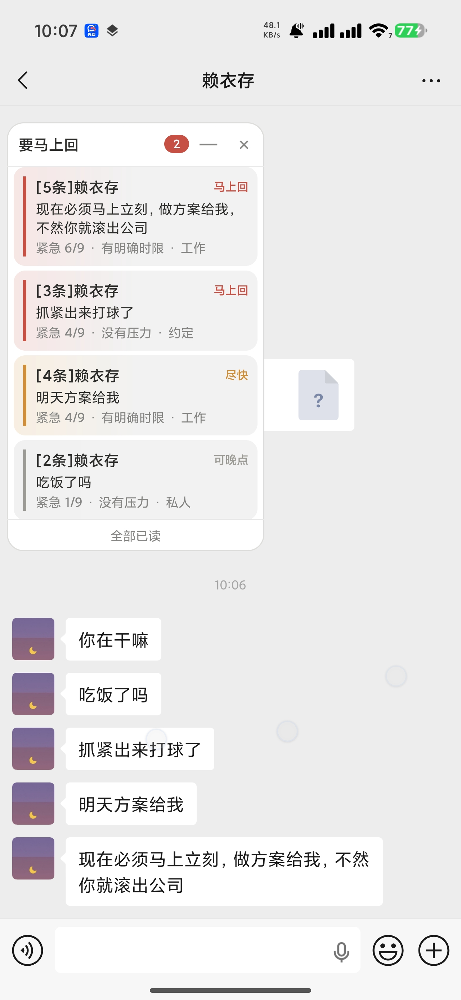
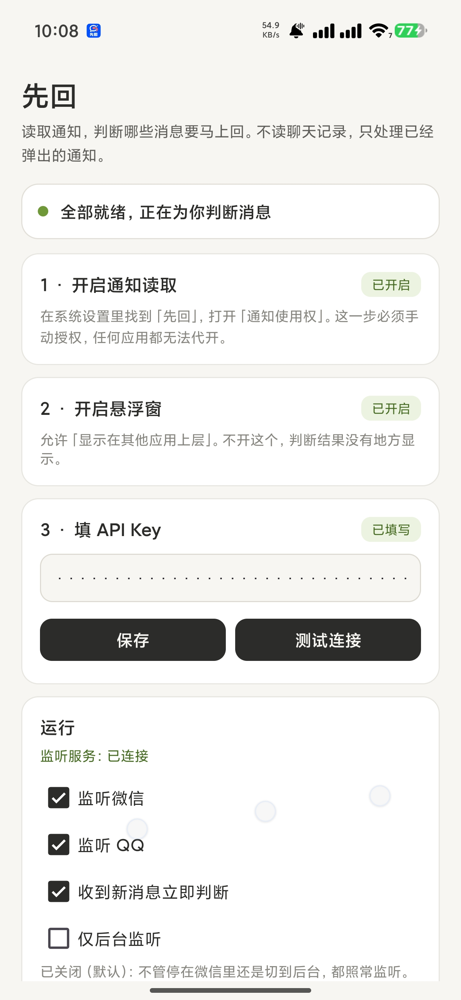
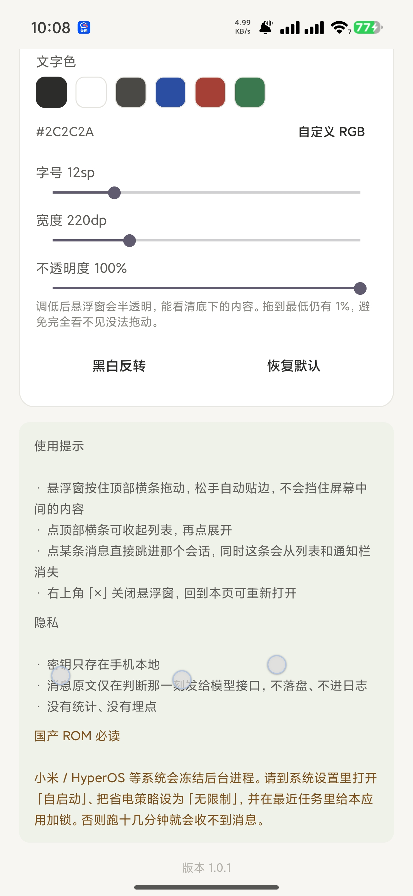

# 先回 · XianHui

> **消息太多，分不清哪条非回不可？让 AI 告诉你先回哪个。**

一个跨平台的**消息优先级助手**：读出待处理的消息 → 判断哪条必须马上回 → 结果放在屏幕边缘的可拖动悬浮窗里。
默认贴在屏幕左边，点某条直接跳回那个会话。

| 平台 | 目录 | 怎么读消息 | 可监听的应用 | 系统要求 | 状态 |
| --- | --- | --- | --- | --- | --- |
| **Android** | [`jev-xianhui/`](jev-xianhui/) | 官方 `NotificationListenerService` 读系统通知 | 微信、QQ、飞书（飞书暂未测试） | Android 8.0+（minSdk 26） | ✅ 可用 |
| **Windows** | — | 截取微信窗口 + 本地离线 OCR | 微信 | Windows 10 / 11 64 位 | 🚧 **待修复中** |

```
    ╭──────────────────────╮
    │ 要马上回  ②       —  ×│   ← 按住这条拖动，松手自动贴边
    ├──────────────────────┤
    │▌同事            马上回│   ← 红
    │ 方案今天能发我吗      │
    │ 紧急 8/9 · 对方在等   │
    │                      │
    │▌妈妈              尽快│   ← 黄
    │ 周末回来吃饭吗        │
    │ 紧急 5/9 · 约定       │
    │                      │
    │▌拼团助手        可晚点│   ← 灰
    │ 您关注的商品降价了    │
    │ 紧急 1/9 · 推广       │
    ├──────────────────────┤
    │       全部已读        │
    ╰──────────────────────╯
```

**由 [Jev](https://github.com/typesafeinc/jev) 判断模型驱动**（TypeSafe 的 System One 决策模型，不是大语言模型）——
它不生成文字，只回答「选哪个 / 打几分 / 是不是」，所以一次判断约 1 秒、约 $0.00004。

### 界面预览

<p align="center">
  
  &nbsp;&nbsp;
  
  &nbsp;&nbsp;
  
</p>
<p align="center"><sub>左：悬浮窗——红/黄/灰三档，按紧急度排序，直接叠在聊天窗上。中：主界面——三张状态卡，每张独立显示自己的完成状态。右：外观设置——文字色、字号、宽度、不透明度均可调。</sub></p>

---

## 目录

- [30 秒了解它怎么工作](#30-秒了解它怎么工作)
- [准备：一个 OpenRouter API Key](#准备一个-openrouter-api-key)
- [悬浮窗怎么用](#悬浮窗怎么用)
- [隐私](#隐私)
- [合规](#合规)
- [常见问题](#常见问题)
- [许可与致谢](#许可与致谢)

---

## 30 秒了解它怎么工作

```
   待处理的消息
        ↓
   一次请求问 Jev 四件事：
   ┌────────────────────────────────────┐
   │ 1. 紧急度？        → 打 1–9 分      │
   │ 2. 要马上回？      → 是 / 否        │
   │ 3. 什么类型？      → 工作/私人/推广… │
   │ 4. 为什么急？      → 有时限/对方在等… │
   └────────────────────────────────────┘
        ↓
   分档 → 悬浮窗显示（红 / 黄 / 灰）
```

分档规则（两端完全一致）：

| 紧急度 | 分档 | 颜色 |
| --- | --- | --- |
| 要马上回，或 ≥ 7 分 | **马上回** | 🔴 红 |
| ≥ 4 分 | 尽快 | 🟡 黄 |
| < 4 分 | 可以晚点 | ⚪ 灰 |
| 还没判断完 | 判断中 | 🔵 蓝 |

消息来源：

- **Android** 用官方 `NotificationListenerService` 读通知栏 —— 不用打开微信，任何发通知的 App 都能接，后台/锁屏也能拿到。

> 想改判断效果，只需要改一个文件：Android 的 `jev/PriorityQuestions.kt`。

---

## 准备：一个 OpenRouter API Key

Android 版需要，**申请一次即可**。

1. 打开 <https://openrouter.ai/keys>，注册 / 登录
2. 点 **Create Key**（可设消费上限，建议设一个，比如 $1）
3. 复制形如 `sk-or-v1-xxxxxxxx…` 的字符串
4. 新注册 OpenRouter 免费使用（应该会有过期时间的）

> Key 只存在本机（App 私有存储），
> 只随判断请求发往 `openrouter.ai`。**源码里没有任何硬编码密钥，本仓库也不含任何密钥文件。**

---

## Android 首次配置（三步）

打开 「先回」，首页是三张卡片，每张对应一步。**卡片徽章红色=没做，绿色=已完成**，按钮在完成后会自动隐藏；顶部有一条总览写着「还差几步」。


1. **开启通知读取权限** —— 点「去开启」→ 系统设置 → 找到「先回」→ 打开 **「通知使用权」**。
   > Android 只允许在系统设置里手动授权，任何 App 都无法代开——这是系统设计，不是缺陷。
2. **开启悬浮窗权限** —— 同样点「去开启」→ 打开 **「允许显示在其他应用上层」**。
3. **填 API Key** —— Android 13+ 会先弹一次通知授权，点**允许**（不授权也能用，但保活通知会被隐藏，后台更容易被回收）。然后粘贴 OpenRouter Key，点**保存**。

回到桌面，悬浮窗应该已经出现；没出现就回 App 点 **「显示悬浮窗」**。

> **开权限**：按主页向导开三项
>
> - **无障碍**（读消息；升级到 1.3 后需要把无障碍关掉再打开一次，截屏能力才生效）
> - **悬浮窗 / 显示在其他应用上层**（展示分析）
> - **自启动 + 省电无限制**（小米 / HyperOS 必做，否则后台被冻结读不到消息）

## 让它在后台活下来（国产 ROM 必做）

MIUI / HyperOS 等会冻结后台进程，需要额外配置：

- 系统设置 → 应用 → 先回 → **自启动** 打开
- 电池 / 省电 → **无限制**（关闭省电优化）
- 最近任务列表里给「先回」**加锁**

各品牌详细对照表见 [`jev-xianhui/docs/DEPLOY.md`](jev-xianhui/docs/DEPLOY.md)。

## 小米 / HyperOS 权限设置教程

小米把权限藏得比较深，按下面两步走（其他品牌思路相同）。

**① 开启通知使用权** —— 「先回」靠系统通知工作，这一步不做就一条消息都收不到。

> 路径：系统设置 → 隐私与安全 → 其它权限 → 「读取、回复和控制通知」→ 找到「先回」打开。
> 弹出「已拒绝此应用获取敏感权限」时，先点「了解相关权限风险」再允许。

**② 开启自启动与通知** —— 防止后台被冻结，也保证通知完整弹出。

> 路径：应用信息 → 打开「自启动」（弹窗提示点「知道了」）；「允许通知」保持开启，尤其是「悬浮通知」和「锁屏通知」。

---

## 悬浮窗怎么用


| 操作 | 效果 |
| --- | --- |
| 按住顶部横条拖动 | 移动位置，**松手自动吸附到最近的屏幕边缘** |
| 点「—」/ 顶部横条 | 收起成计数小横条 / 展开 |
| 点某条消息 | 跳进那个会话并清除该条 |
| 点「全部已读」 | 清空列表并清掉对应的系统通知 |
| 点「×」 | 关闭悬浮窗，回主页可重新打开 |

颜色含义：**红=马上回**，**黄=尽快**，**灰=可以晚点**，**蓝=正在判断**。

**外观可自定义**：背景色 / 文字色 / 字号 / 宽度 / 不透明度，改动立即生效。
只需选两个颜色（背景 + 文字），行底色、描边、次要文字、四个优先级强调色全部由这两个颜色**推导**出来——
所以深色底会自动用浅色强调色，不会出现「深色底上看不清红点」。另有**黑白反转**（一键做深色模式）与**恢复默认**。
设置界面会实时检查对比度（低于 3:1 提示「几乎看不清」），但**不会阻止你选**。

**高度随消息数量伸缩**：没消息时是一条细条（40 dp），有消息按行高累加，上限 300 dp，再多就在卡片内滚动。

---

## 隐私

- **API Key 只存本机**（App 私有存储），随判断请求发出。
- **消息原文只在判断那一刻发给模型接口**，不落盘、不进日志、不存历史。唯一的网络出口是 `jev/HttpJson.kt` 里那一个 POST。
- **无统计、无埋点、无上报**。
- 重启后列表清空（有意为之，避免留下聊天痕迹）。

---

## 合规

- 使用 Android **官方** `NotificationListenerService` API。不 Root、不伪造系统服务、不绕过应用安全机制、不读取聊天数据库，权限仅 INTERNET / SYSTEM_ALERT_WINDOW / POST_NOTIFICATIONS / FOREGROUND_SERVICE。
- **只判断，不代回**：回复永远由你自己发，程序从不自动发送、不碰转账 / 红包 / 收款。

请仅在自己拥有或已获授权的设备上使用，遵守各软件用户协议与当地法律法规。

---

## 常见问题

<details>
<summary><b>Android</b></summary>

**Q：装完没有悬浮窗 / 判断不工作？**
A：按首页三张卡逐项检查徽章颜色。红=未完成：通知使用权、悬浮窗权限、API Key 三项都要绿。

**Q：过一会儿就不判断了？**
A：国产 ROM 后台冻结。见 [让它在后台活下来](#让它在后台活下来国产-rom-必做)。

**Q：长消息内容不全？**
A：通知里只有开头一截，看不到完整上下文。对「要不要马上回」来说，第一句话通常够了。

**Q：为什么点某条不跳到那个会话？**
A：跳转行为取决于各 App 自己构造的通知 `contentIntent`。以「点系统通知栏的行为」为准；个别机型需开「后台弹出界面」权限。

**Q：什么时候有 Windows 版？**
A：Windows 版正在修复中，修好会恢复发布并更新这份文档。

</details>

---

## 许可与致谢

[MIT](LICENSE)

本项目参考了开源项目 **[jev-chat-jarvis](https://github.com/jev-chat/jev-chat-jarvis)**。
